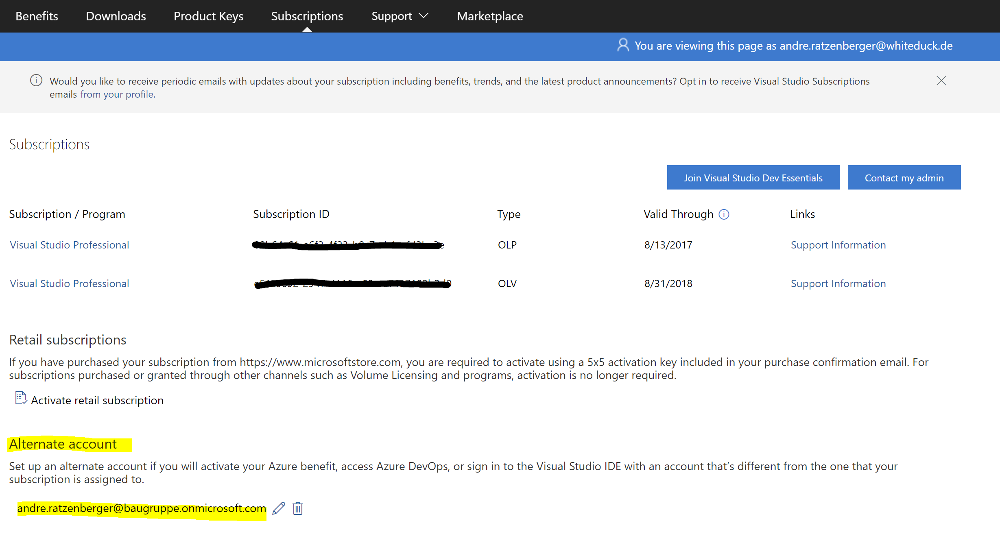

# Verknüpfen des VisualStudio Developer Acounts mit dem Azure-AD Account

In der Regel werden für Visual Studio Lizenzen diese über eine E-Mail provisioniert welche nicht mit dem AAD verknüpft ist. Dies passiert zum Beispiel wenn man diese Lizenzen bezieht bevor überhaupt ein AAD existiert.

Es empfiehlt sich diese Visual Studio E-Mail mit dem AAD Account zu verknüpfen damit man die Möglichkeit hat in Azure DevOps diese Visual Studio Lizenz nutzen zu können. Auch funktioniert danach die DevOps-Integration in Visual Studio.

Folgende Schritte muss man ausführen um die beiden Accounts miteinander zu verknüpfen:

1. Mit der zu Visual Studio verknüpften E-Mail unter https://my.visualstudio.com/Subscriptions anmelden
2. Auf dieser Seite unter **Alternate Account** die E-Mail zum AAD-Account hinterlegen
   

Danach ist die VisualStudio Lizenz auch über den AAD-Account verfügbar.

Zur Verifikation ob die Verknüpfung zustande gekommen ist kann mit im Azure DevOps auf Organisationsebene unter *"Organization Settings -> User"* prüfen ob der entsprechende User nun eine VisualStudio Lizenz verknüpft hat

