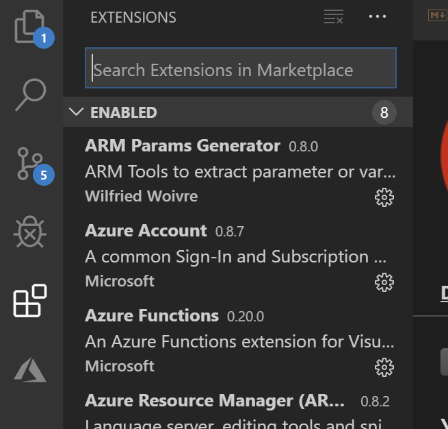

# Einrichten der Entwicklungstools

## VisualStudio Code

Für die Entwicklung von ARM-Templates und YAML-Pipelines empfiehlt sich **VisualStudio Code**, da über Extensions eine sehr gute Integration der entsprechenden Featuresets gewährleistet wird, die man zum Beispiel in VisualStudio nicht hat.

**VisualStudio Code** lässt sich hier downloaden: https://code.visualstudio.com/

Desweiteren ein paar Empfehlungen für Extensions um ein entspanntes Arbeiten mit ARM und YAML zu ermöglichen:

Installieren lassen sich Extensions über das Extension-Menü in dem man über den Namen eine bestimmte Extension suchen kann oder über den Marketplace-Link.

+ Azure Resource Manager (ARM) Tools
  + https://marketplace.visualstudio.com/items?itemName=msazurermtools.azurerm-vscode-tools 

+ YAML
  + https://marketplace.visualstudio.com/items?itemName=redhat.vscode-yaml 

## Git

Da für die Repositories auf Azure DevOps git verwendet wird muss Git installiert werden um das git feature set in VisualStudio Code nutzen zu können.

https://git-scm.com/download/win

Die default Einstellungen im Installer sollten ausreichen. Bei Bedarf natürlich entsprechende Optionen setzen!

  