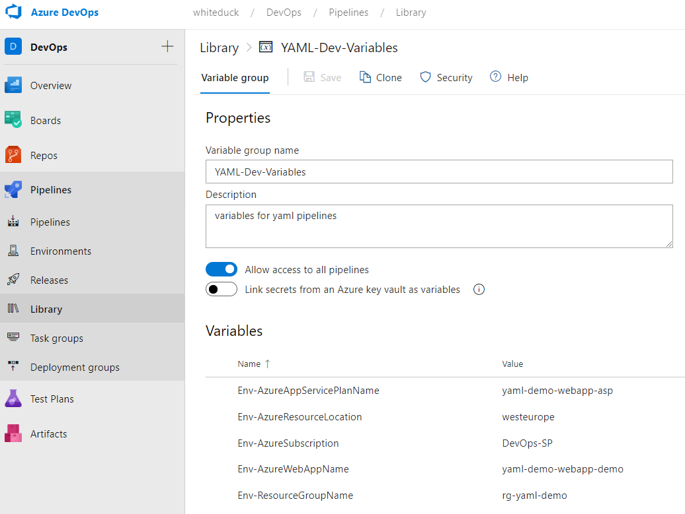

# Einführung in Azure DevOps YAML Pipelines

Pipelines in Azure DevOps werden mit YAML beschrieben.

Die offizielle Dokumentation ist hier zu finden: 

https://docs.microsoft.com/en-us/azure/devops/pipelines/?view=azure-devops

## Aufbau einer YAML Datei

### Trigger

```
trigger:
  branches:
    include:
    - master
    - fb/*
  paths:
    include:
    - src/yaml-demo-webapp/*
    - .azure/pipelines/webapp/*
```

Der erste Abschnitt einer YAML Datei ist in der Regel der **Trigger**. Dieser definiert unter welchen Conditions die Pipeline starten soll.

In diesem Beispiel triggert die Pipeline bei Änderungen im *'master'* Branch sowie in allen Branches die mit *'fb/'* beginnen **UND** wenn sich diese Änderungen in den Ordnern *'src/yaml-demo-webapp/'* oder *'.azure/pipelines/webapp/'* befinden 

### Variables

```
variables:
  - group: YAML-Dev-Variables
```

Mit dem **variables** Block kann eine Azure DevOps Variablengruppe hinterlegt werden, aus dieser sich die Pipeline die Werte zieht.

Definiert können diese Variablengruppen im Azure DevOps unter *'Pipelines -> Library'*



Um Variablen daraus zu refernzieren werden diese mit `$(variable)` in der YAML angegeben.

Variablengruppen dienen dazu für zum Beispiel verschieden Environments unterschiedliche Werte hinterlegen zu können.
So kann man eine Variablengruppe jeweils für DEV,TEST,PROD definieren und in dieser dann auf die, für das Environment, relevante Werte ablegen.

### Stages

```
stages:
- stage: Build
- stage: Deploy
```

Stages sind das "Herzstück" einer Pipeline. Hier wird der Ablauf einer Pipeline definiert.

Eine Stage kann aus mehreren Jobs bestehen welche wiederum mehrere Tasks pro Job enthalten können.

```
- stage: Build
  displayName: Build stage
  jobs:
  - job: 'BuildArtifact'
    pool:
      vmImage: 'ubuntu-latest'
    steps:
    - task: CopyFiles@2
      inputs:
        SourceFolder: '.azure/infrastructure/'
        Contents: '**'
        TargetFolder: 'iac'
    - task: PublishPipelineArtifact@1
      inputs:
        targetPath: 'iac'
        artifact: 'drop'
```

Diese Stage *'Build'* hat einen Job '*BuildArtifact*' der auf einen '*Ubuntu-Agent*' ausgeführt wird mit zwei Tasks.

In der Regel empfiehlt es sich den Ablauf einer Pipeline in zwei Stages aufzugliedern.

#### Build Stage

Diese Stage dient dazu eine **Artifact** zu erzeugen welches in der Deploy Stage veröffentlicht wird.

Das Artifact ist ein Builderzeugnis. Im Falle von Quellcode beinhaltet das Artifact die zu veröffentlichenden Assemblies oder im Falle von Assets (ARM-Templates, Dokumentation etc.) die entsprechenden Dateien, die so der Deploment Stage verfügbar gemacht werden.

#### Deploy Stage

Diese Stage wird dazu verwendet das **Artifact** auf die Zielumgebung zu deployen.

## Wichtige Tasks


### [AzureResourceManagerTemplateDeployment@3](https://docs.microsoft.com/en-us/azure/devops/pipelines/tasks/deploy/azure-resource-group-deployment?view=azure-devops)

Deployt ein ARM-Template.
Hier ist der Parameter "deploymentMode" hervorzuheben. Mit dem Wert "Validation" lässt sich ein ARM-Template auf korrektheit testen.

### [DotNetCoreCLI@2](https://docs.microsoft.com/en-us/azure/devops/pipelines/tasks/build/dotnet-core-cli?view=azure-devops)

Ruft die .net-core CLI auf

### [AzureWebApp@1](https://docs.microsoft.com/en-us/azure/devops/pipelines/tasks/deploy/azure-rm-web-app?view=azure-devops)

Mit diesem Task provisioniert man eine gebuildete WebApp auf Azure

### [CopyFiles@2](https://docs.microsoft.com/en-us/azure/devops/pipelines/tasks/utility/copy-files?view=azure-devops&tabs=yaml)

Ein Task den man oft benutzen muss. Diese Task dient zum kopieren von Dateien.

