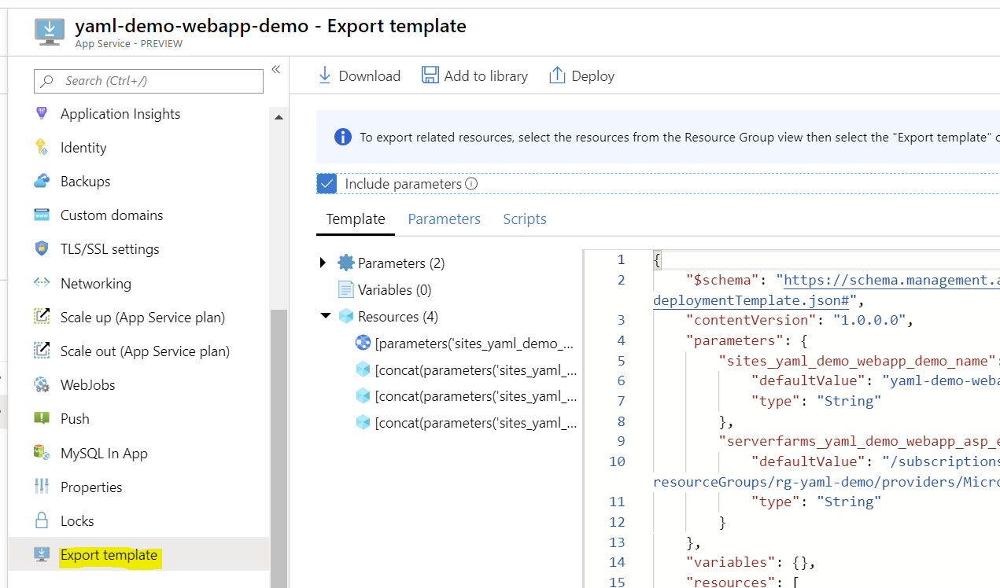
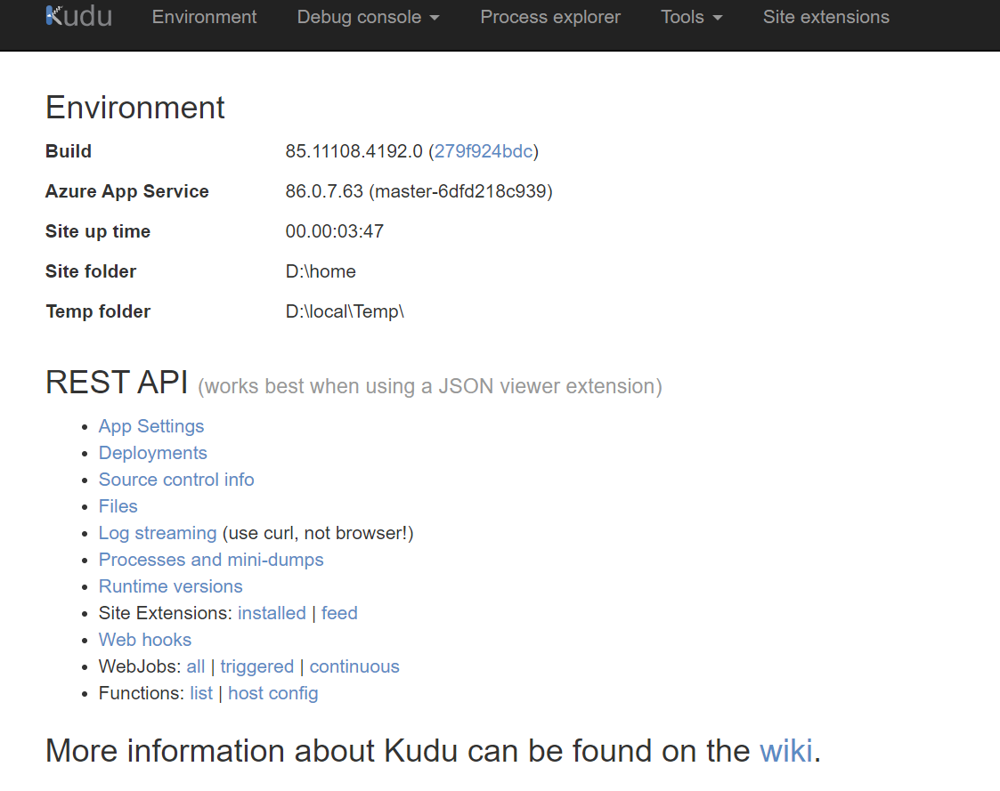
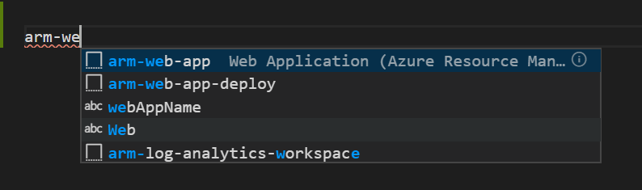

# Tipps & Tricks

## Herangehensweiße für das automatische Deployment

1. YAML Pipeline für die Infrastruktu anlegen

In der Regel ändert sich dieses Template nicht, und kann von Projekt zu Projekt übernommen werden. Sinn dieses Template ist es ein ARM-Template zu deployen.

Siehe yaml-File in .azure\pipelines\infrastructure\azure-pipelines.yaml

Für das Testen des Templates empfiehlt es sich den "deploymetmode" der Pipeline auf "Validation" zu setzen.

2. ARM Template schreiben

Die Ressource die man bereitstellen will im ARM Template beschreiben.

Siehe .azure\infrastructure\azuredeploy.json

3. Code hinzufügen

Den Code den man veröffentlichen und bereitstellen will dem Projekt hinzufügen

Siehe src-Ordner.

4. YAML Pipeline für das Builden und das Deployen der Applikation hinzufügen

Abschließend kann die Pipeline zum Erstellen der Build-Artefakte und deren Veröffentlichung geschrieben werden

Siehe .azure\pipelines\webapp\azure-pipelines.yaml

## Reverse Engineering des ARM Templates von Ressourcen

Azure bietet die Möglichkeit Ressourcen über das Portal anzulegen, und diese dann zu "reverse engineeren" um so an die ARM Beschreibung der jeweiligen Ressource zu kommen.

Virtuell jede Ressource bietet eine "Export template" Funktion um an das Template heranzukommen.

Es sei jedoch angemerkt, dass dieses Template sehr "gesprächig" ist. Viele optionale Parameter die man im normalen ARM Gebrauch nicht braucht werden durch diesen Export mit angeführt auch ist die Deploymenthistorie in diesem Template zu finden.

Für einen Überblick wie eine Ressourcegruppe und dessen Ressourcen aufgebaut sind kann diese Funktion aber dennoch hilfreich sein.

## Testen von ARM Templates über PowerShell

Mit dem PowerShell Befehl "new-azresourcegroupdeployment" lässt sich alternativ zum "Validation"-Modus ein ARM-Template testen.

Dieses Modul setzt die Installation der AZ-PowerShellModule voraus:

Installation:

https://www.powershellgallery.com/packages/Az/3.0.0

Dokumentation:

https://docs.microsoft.com/en-us/powershell/module/az.resources/new-azresourcegroupdeployment?view=azps-3.0.0

## KUDU

Änder man die URI einer WebApp wie folgt:

*https://my-app.azurewebsites.net*

zu 

*https://my-app.**scm**.azurewebsites.net*

so gelangt man in die Administrationsoberfläche einer WebApp namens KUDU

In dieser lassen sich log-Files auswerten, Prozesse auswerten und andere administrative Tools bedienen.

Die Dokumentation zu KUDU ist hier zu finden:

https://github.com/projectkudu/kudu/wiki

## Visual Studio Code Tipps

### STRG+SHIFT+P

Globale Funktionssuche von VSC. 

### arm! Commands

Befindet man sich in einer *.json Datei und tippt arm! so erhält man ein ARM-Template-Skeleton.

Desweiteren lassen sich mit "arm-{ressource}" Templates für bestimmte Ressourcen in den Ressourceblock einfügen.

